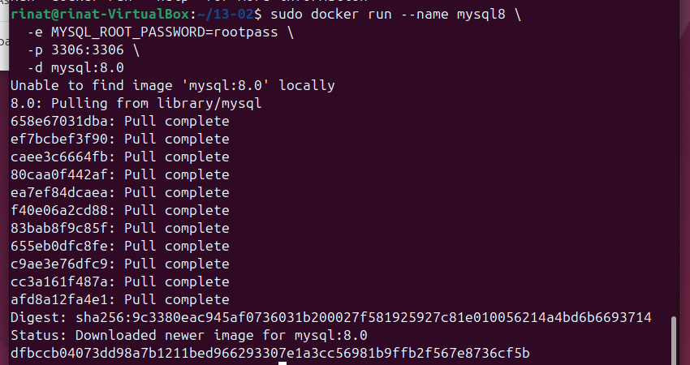
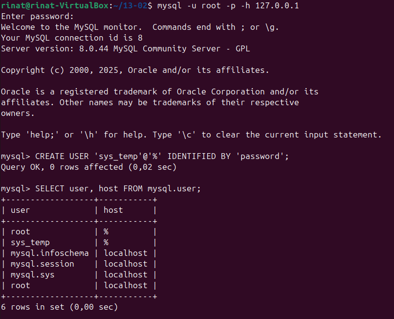
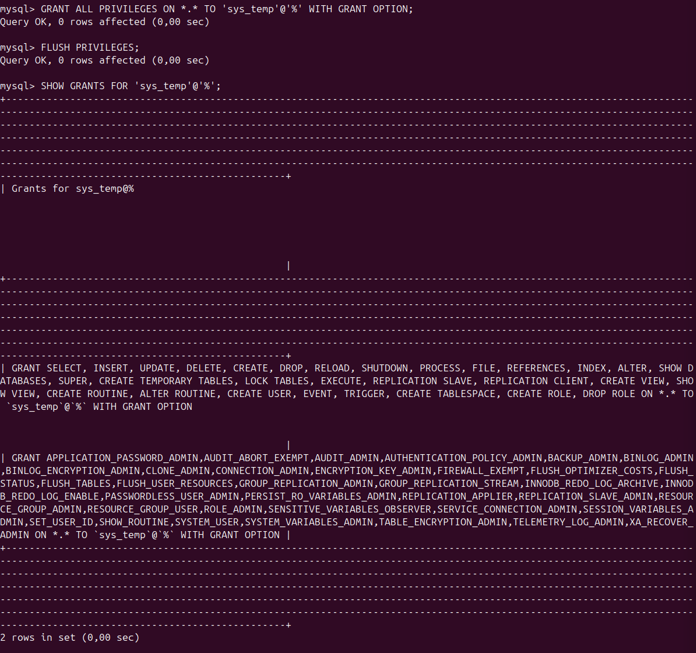
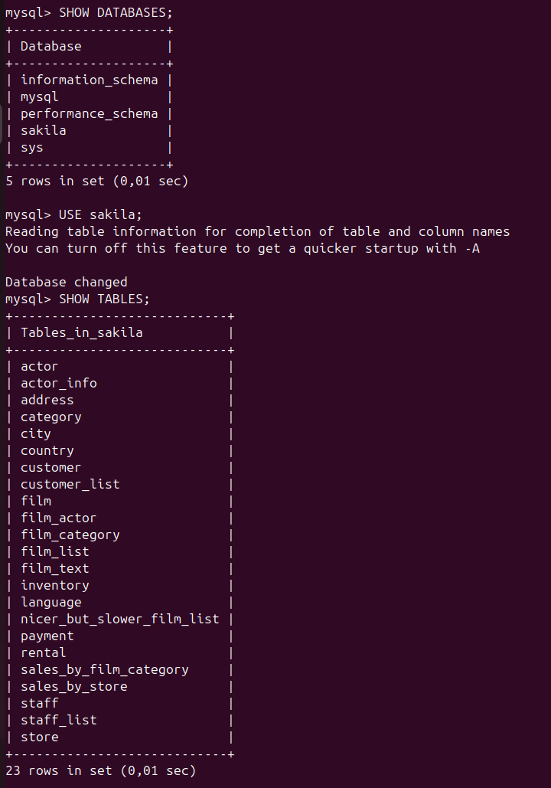

# Домашнее задание к занятию "`Работа с данными (DDL/DML)`" - `Серкебаев Ринат`

https://github.com/netology-code/sdb-homeworks/blob/main/12-02.md


### Задание 1 

Поднятие контейнера mysql 8.0:



Создание учетной записи sys_temp и запрос на получение списка пользователей в БД:



Выдача всех прав пользователю sys_temp и запрос на получение списка прав для пользователя sys_temp:



Подключение к БД от имени sys_temp:


Восстановление дампа в БД:


Получение всех таблиц БД:



Простыня со всеми SQL-запросами
```
CREATE USER 'sys_temp'@'%' IDENTIFIED BY 'password';

SELECT user, host FROM mysql.user;

GRANT ALL PRIVILEGES ON *.* TO 'sys_temp'@'%' WITH GRANT OPTION;
FLUSH PRIVILEGES;

SHOW GRANTS FOR 'sys_temp'@'%';

ALTER USER 'sys_temp'@'%' IDENTIFIED WITH mysql_native_password BY 'password';

SHOW DATABASES;
USE sakila;
SHOW TABLES;
```

### Задание 2

Название таблиц восстановленной БД в левой колонке, ключи в правой колонке:

```
actor            | actor_id
address          | address_id
category         | category_id
city             | city_id
country          | country_id
customer         | customer_id
film             | film_id
film_actor       | (actor_id, film_id)
film_category    | (film_id, category_id)
film_text        | film_id
inventory        | inventory_id
language         | language_id
payment          | payment_id
rental           | rental_id
staff            | staff_id
store            | store_id
```


